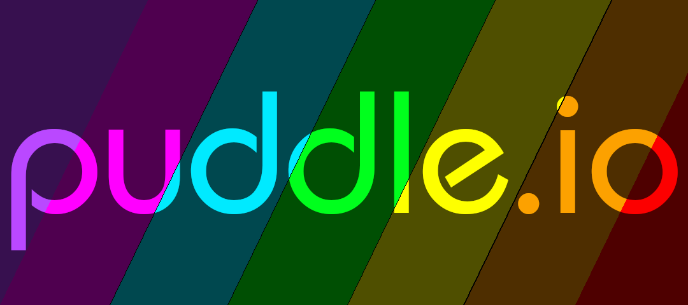

# puddle.io is a browser game about making ripples in a pond with strangers online!

puddle.io gives each player a dark reflection pond, and players can see each other make multicolored ripples. These ripples spill into each other creating a colorful reflection pool!

Players can click around and hover over other's ripples to see which stranger out there made a splash. The more you click, the more types of ripples you unlock and you get the chance to make a big ripple! Other means of interaction will be procedurally unlocked as players splash around.

This is really meant as more of a social creativity exercise rather than a game, and is currently under active development. An alpha build is available here to demo! The alpha build is currently able to connect to a server and make ripples with others synchronously.

Improvments and optimizations need to be made to the ripple generation algorithm as it uses canvas and is currently a bit slow. Bitwise operations could serve to improve things in its current rudimentary state. 

# Build instructions

1. clone the git repo
2. In the cloned directory, make sure you have Node.JS installed and type ```node index.js```
3. Now, open two web clients and connect ```localhost:8000```. 
4. Have fun making ripples!
